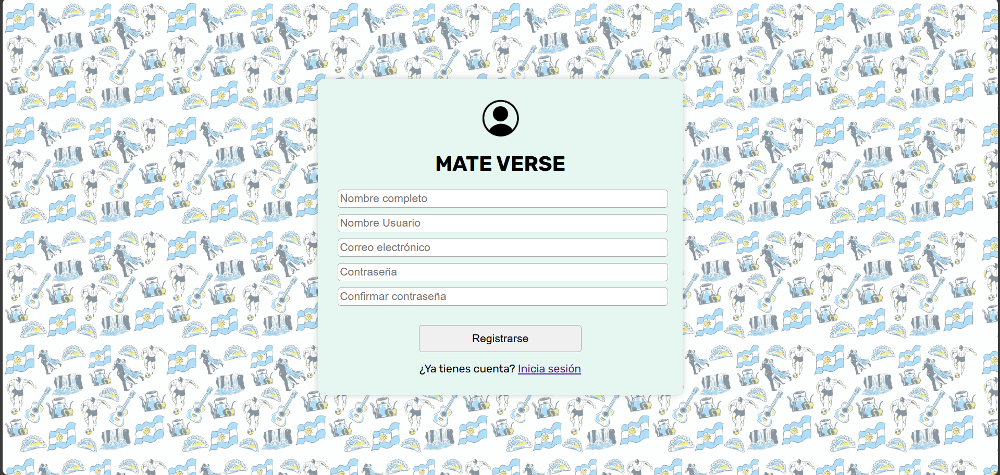
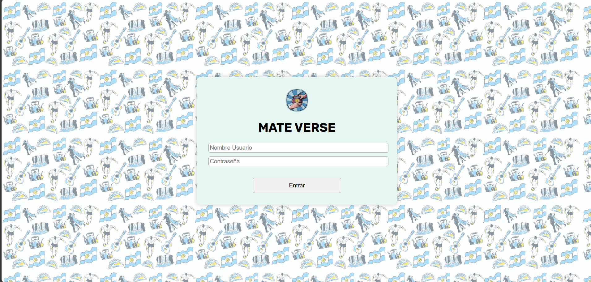
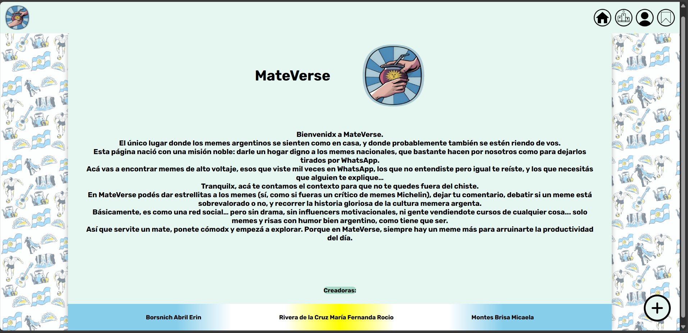
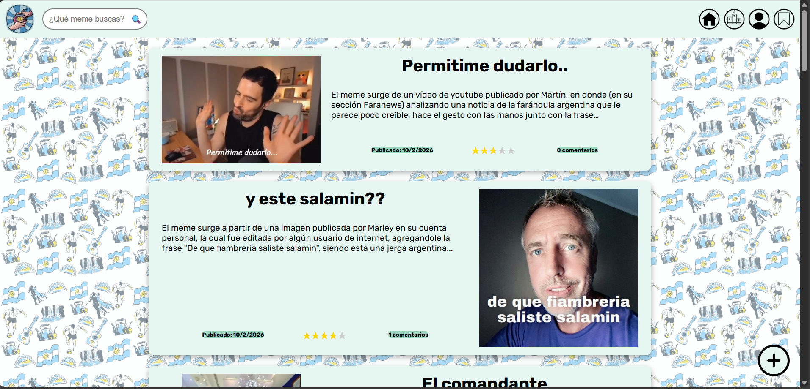
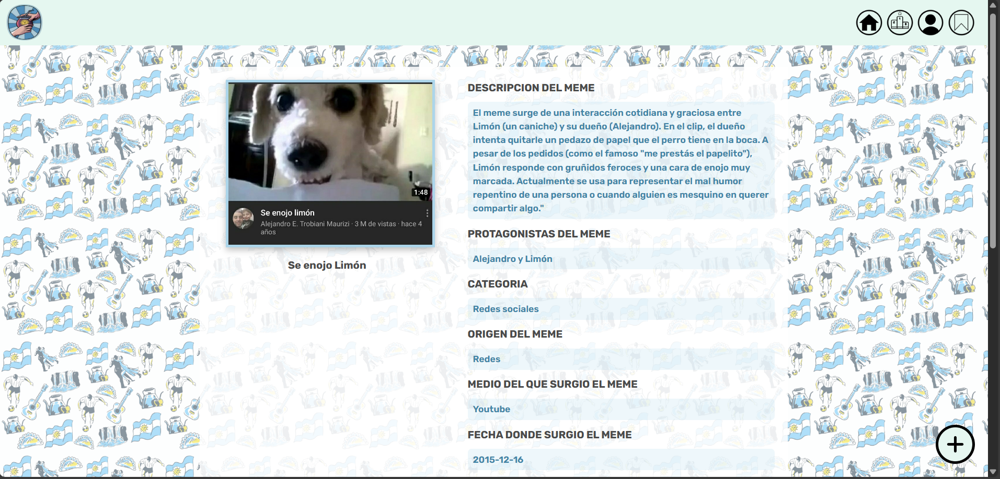
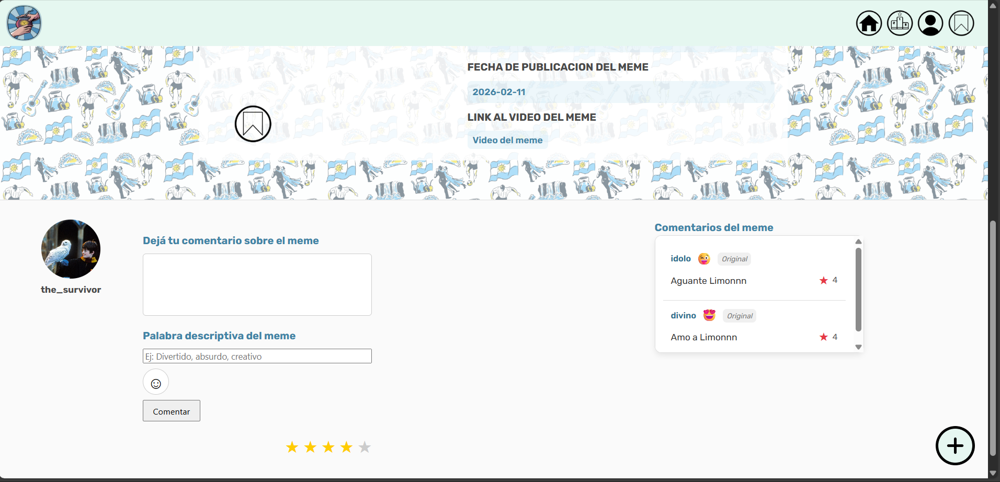
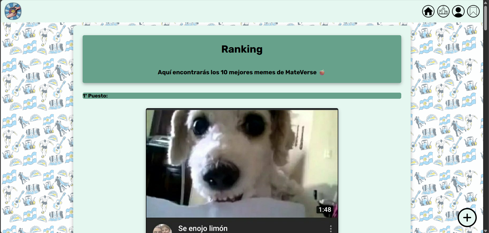
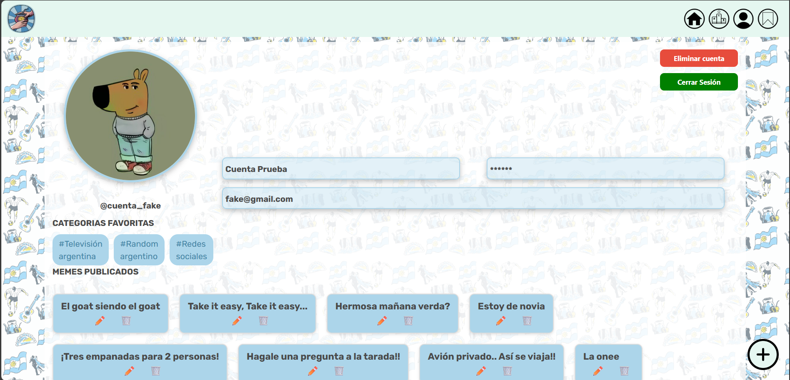
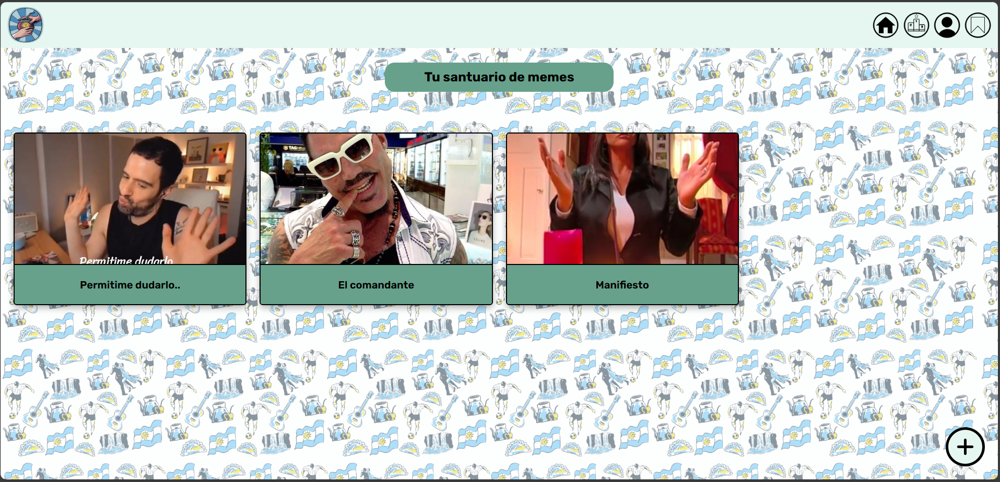
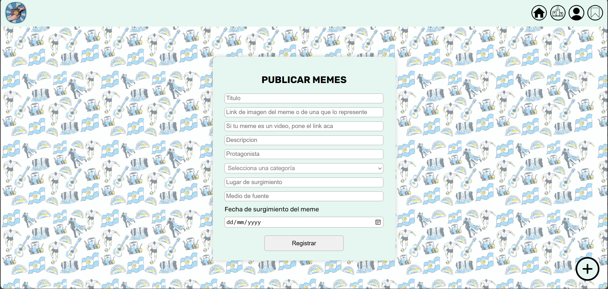

<h1 align="center">🇦🇷 MateVerse 🧉</h1>

**Mateverse** es un sitio web colaborativo donde los usuarios pueden descubrir, subir y comentar memes del "lore argentino" (memes históricos, políticos, televisivos, deportivos, etc.), con su trasfondo y contexto sociocultural. Esta surgió con la idea de mostrar nuestra cultura a un nuevo público, permitiendoles ser parte de la misma.

---
## Contenido:
- [Estructura del proyecto](#estructura-del-proyecto)
- [Tablas de la Base de Datos](#tablas-de-la-base-de-datos)
- [Requisitos previos para el proyecto](#requisitos-previos-para-el-proyecto)
- [Requisitos opcionales para el proyecto](#requisitos-opcionales-para-el-proyecto)
- [Pasos para levantar el proyecto](#pasos-para-levantar-el-proyecto)
- [Pasos para bajar el proyecto](#pasos-para-bajar-el-proyecto)
- [Comando útiles en desarrollo](#comandos-útiles-en-desarrollo)
- [Recorrido por la página](#recorrido-por-la-página)
- [Créditos](#créditos)
---

## Estructura del proyecto:
El proyecto consta de 3 partes:
- ` Backend: ` Este es una API REST construida con Express que expone endpoints creados para realizar operaciones sobre las distintas entidades (más adelante se específican).
- ` Base de Datos: ` Un contenedor con PostgreSQL, configurado con usuario, contraseña y base de datos predeterminados. Almacena toda la info del proyecto.
- ` Frontend: ` Esta usa como base al servidor estático Nginx, permitiendo levantar la parte "visual" de nuestra página, mostrando la interfaz web que interactúa con el backend.

---
## Tablas de la Base de Datos:

### Usuarios
<table border="1" cellpadding="5" cellspacing="0">
  <tr>
    <th>Campo</th><th>Tipo de dato</th><th>Descripción</th>
  </tr>
  <tr>
    <td>id_usuario</td>
    <td>SERIAL</td>
    <td>Identificador único del usuario (Primary Key)</td>
  </tr>
  <tr>
    <td>nombre_completo</td>
    <td>VARCHAR(100)</td>
    <td>Nombre y apellido del usuario (no núlo)</td>
  </tr>
  <tr>
    <td>nombre_usuario</td>
    <td>VARCHAR(100)</td>
    <td>Nombre de usuario (no núlo y único)</td>
  </tr>
  <tr>
    <td>email</td>
    <td>VARCHAR(100)</td>
    <td>Correo electrónico del usuario (no núlo y único)</td>
  </tr>
  <tr>
    <td>contrasenia</td>
    <td>VARCHAR(100)</td>
    <td> contraseña del usuario (no núla)</td>
  </tr>
  <tr>
    <td>fecha_registro</td>
    <td>DATE</td>
    <td>Fecha de creación de la cuenta (no núla, se crea automaticamente)</td>
  </tr>
  <tr>
    <td>foto_perfil</td>
    <td>TEXT</td>
    <td>URL de la foto de perfil, si no tiene se coloca una por default</td>
  </tr>
</table>

### Categorías
<table border="1" cellpadding="5" cellspacing="0">
  <tr><th>Campo</th><th>Tipo de dato</th><th>Descripción</th>
  </tr>
  <tr>
    <td>id_categoria</td>
    <td>SERIAL</td>
    <td>Identificador único de la categoría(Primary Key)</td>
  </tr>
  <tr>
    <td>nombre</td>
    <td>VARCHAR(100)</td>
    <td>Nombre de la categoría (no núlo y único)</td>
  </tr>
</table>

### Contextos
<table border="1" cellpadding="5" cellspacing="0">
  <tr><th>Campo</th><th>Tipo de dato</th><th>Descripción</th>
  </tr>
  <tr>
    <td>id_contexto</td>
    <td>SERIAL</td>
    <td>Identificador único del contexto(Primary Key)</td>
  </tr>
  <tr>
    <td>origen</td>
    <td>VARCHAR(100)</td>
    <td>Lugar, situación donde surgió (“TV”, “Redes”, etc), no núlo</td>
  </tr>
  <tr>
    <td>medio_fuente</td>
    <td>VARCHAR(100)</td>
    <td>En qué programa, evento, red social surgió ("Tik Tok", "Telefe", etc), no núlo</td>
  </tr>
  <tr>
    <td>fecha_original</td>
    <td>DATE</td>
    <td>Cuando ocurrió la situación que originó el meme</td>
  </tr>
</table>

### Memes
<table border="1" cellpadding="5" cellspacing="0">
  <tr><th>Campo</th><th>Tipo de dato</th><th>Descripción</th>
  </tr>
  <tr>
    <td>id_meme</td>
    <td>SERIAL</td>
    <td>Identificador único del meme(Primary Key)</td>
  </tr>
  <tr>
    <td>titulo</td>
    <td>VARCHAR(100)</td>
    <td>Palabra o frase como se conoce al meme (no nula)</td>
  </tr>
  <tr>
    <td>imagen_url</td>
    <td>TEXT</td>
    <td>link a la foto del meme (no nula)</td>
  </tr>
  <tr>
    <td>video_url</td>
    <td>TEXT</td>
    <td>link al video del meme</td>
  </tr>
  <tr>
    <td>descripcion</td>
    <td>TEXT</td>
    <td>Breve texto sobre el meme (no nula)</td>
  </tr>
  <tr>
    <td>protagonistas</td>
    <td>VARCHAR(200)</td>
    <td>Si son famosos, nombre de las personas involucradas</td>
  </tr>
  <tr>
    <td>usuario_id</td>
    <td>INTEGER</td>
    <td>FK a <code>id_usuario</code></td>
  </tr>
  <tr>
    <td>categoria_id</td>
    <td>INTEGER</td>
    <td>FK a <code>id_categoria</code></td>
  </tr>
  <tr>
    <td>contexto_id</td>
    <td>INTEGER</td>
    <td>FK a <code>id_contexto</code></td>
  </tr> 
  <tr>
    <td>fecha_publicacion</td>
    <td>DATE</td>
    <td>Fecha en que se publico el meme (no nula y puesta automaticamente)</td>
  </tr> 
</table>

### Puntuaciones_memes
Tabla intermedia entre **Usuarios** y **Memes** que permite guardar el puntaje que cada usuario le da a un meme. La PRIMARY  KEY es (meme_id, usuario_id) ya que un usuario puede puntear una única vez cada meme.
<table border="1" cellpadding="5" cellspacing="0">
  <tr><th>Campo</th><th>Tipo de dato</th><th>Descripción</th>
  </tr>
  <tr>
    <td>meme_id</td>
    <td>INTEGER</td>
    <td>FK a <code>id_meme</code></td>
  </tr>
  <tr>
    <td>usuario_id</td>
    <td>INTEGER</td>
    <td>FK a <code>id_usuario</code></td>
  </tr>
  <tr>
    <td>puntaje</td>
    <td>INTEGER</td>
    <td>Puntaje que el meme recibió por parte de un usuario (no nula)</td>
  </tr>
</table>

### Comentarios
<table border="1" cellpadding="5" cellspacing="0">
  <tr><th>Campo</th><th>Tipo de dato</th><th>Descripción</th>
  </tr>
  <tr>
    <td>id_comentario</td>
    <td>SERIAL</td>
    <td>Identificador único del comentario(Primary Key)</td>
  </tr>
  <tr>
    <td>contenido</td>
    <td>TEXT</td>
    <td>texto del comentario (no nulo)</td>
  </tr>
  <tr>
    <td>descripcion_una_palabra</td>
    <td>VARCHAR(50) con restriccion</td>
    <td>Como describiria el meme en una palabra(no nulo, con una restriccion que asegura una sola palabra)</td>
  </tr>
  <tr>
    <td>reaccion</td>
    <td>VARCHAR(20)</td>
    <td>Reaccion que le da al comentario</td>
  </tr>
  <tr>
    <td>fecha_creacion</td>
    <td>DATE</td>
    <td>Fecha en la que se realizó el comentario (no nula, se crea automaticamente)</td>
  </tr>
  <tr>
    <td>editado</td>
    <td>BOOLEAN</td>
    <td>Indica si el comentario fue o no editado (no nulo)</td>
  </tr>
  <tr>
    <td>meme_id</td>
    <td>INTEGER</td>
    <td>FK a <code>id_meme</code></td>
  </tr>
  <tr>
    <td>usuario_id</td>
    <td>INTEGER</td>
    <td>FK a <code>id_usuario</code></td>
  </tr>
</table>

### Likes_comentarios
Tabla intermedia entre **Comentarios** y **Usuarios** que permite guardar el like que el usuario le da a un comentario. La PRIMARY  KEY es (usuario_id, comentario_id) ya que un usuario puede likear una única vez cada comentario.
<table border="1" cellpadding="5" cellspacing="0">
  <tr><th>Campo</th><th>Tipo de dato</th><th>Descripción</th>
  </tr>
  <tr>
    <td>usuario_id</td>
    <td>INTEGER</td>
    <td>FK a <code>id_usuario</code></td>
  </tr>
  <tr>
    <td>comentario_id</td>
    <td>INTEGER</td>
    <td>FK a <code>id_comentario</code></td>
  </tr>
</table>

### Usuarios_memes_guardados
Tabla que indica que meme guardó cada usuario. La PRIMARY  KEY es(meme_id, usuario_id) ya que un usuario puede guardar una única vez cada meme.
<table border="1" cellpadding="5" cellspacing="0">
  <tr><th>Campo</th><th>Tipo de dato</th><th>Descripción</th>
  </tr>
  <tr>
    <td>meme_id</td>
    <td>INTEGER</td>
    <td>FK a <code>id_meme</code></td>
  </tr>
  <tr>
    <td>usuario_id</td>
    <td>INTEGER</td>
    <td>FK a <code>id_usuario</code></td>
  </tr>
</table>

---

## Requisitos Previos para el proyecto:
- [Tener Git instalado](https://git-scm.com/book/es/v2/Inicio---Sobre-el-Control-de-Versiones-Instalaci%C3%B3n-de-Git)
- [Tener Docker y Docker-Compose](https://docs.docker.com/compose/install/)

## Requisitos opcionales para el proyecto:
**Si queres correr el backend o la base de datos localmente sin docker:**
- [Tener Node.js (v18 o superior)](https://nodejs.org/es)
- [Tenes PostgreSQL](https://www.postgresql.org/download/)

## Pasos para levantar el proyecto:

### 1- Clona el repositorio:
```git clone git@github.com:mikuu-montes/MateVerse-Devs4U.git``` o ```git clone https://github.com/mikuu-montes/MateVerse-Devs4U.git```

### 2- Moverse a la carpeta del proyecto:
```cd MateVerse-Devs4U```

### 3- Levantar los servicios:

#### 3.1- Levantar todos los servicios juntos:    
```docker compose up --build```

**Esto permite:**
- Levantar una base de datos PostgreSQL.
- Levantar las tablas necesarias en la base de datos.
- Iniciar el backend (Express).
- Iniciar el frontend.

#### 3.2- Levantar los servicios individualmente:

- Levantar la Base de Datos: ```docker compose up db``` o ```make start-database```
- Levantar el backend: ```docker compose up backend``` o ```start-backend```
- Levantar el backend junto con la base de datos: ```docker compose up db backend``` o ```make start-backend-completo```
- Levantar el frontend: ```docker compose up frontend```.

## Pasos para bajar el proyecto:

### 1- Dar de baja los servicios:

#### 1.1- Dar de baja todos los servicios juntos:
```docker compose down```

#### 1.2- Dar de baja los servicios individualmente:

- Bajar la Base de Datos: ```docker compose down db``` o ```make stop-database```
- Bajar el backend: ```docker compose down backend``` o ```make stop-backend```
- Bajar el backend junto con la base de datos: ```docker compose down db backend``` o ```make stop-backend-completo```
- Bajar el frontend: ```docker compose down frontend```

## Comandos útiles en desarrollo:
- ```make ver-database``` permite ingresar desde la terminal a la base de datos, dejandonos la posibilidad de manipularla fácilmente (ver tablas, agregar cosas, sacar cosas, etc).
- ```make restart-backend-completo``` permite "reiniciar" el backend junto con la base de datos.
- ```make restart-pagina``` permite "reiniciar" el proyecto completo.

## Recorrido por la página:
Las siguientes imágenes son las distintas secciones que tiene la página.

### Página de Registro de Nuevo Usuario


### Página de Inicio de Sesión


### Página de información sobre Mateverse



### Página de Inicio



### Página 1 de Visualización de un meme 


### Página 2 de Visualización de un meme 


### Página de Ranking de los mejores memes


### Página del Perfil del usuario


### Página de la Coleccion de memes guardados por el usuario


### Página para Publicar un nuevo meme



## Créditos:
Este trabajo fue realizado como tarea para la materia de **Introducción al Desarrollo del Software**, cátedra **Camejo**, en la **UBA**, por las alumnas:
- **Borsnich Abril Erin**
- **Montes Brisa Micaela**
- **Rivera de la Cruz María Fernanda Rocío**

